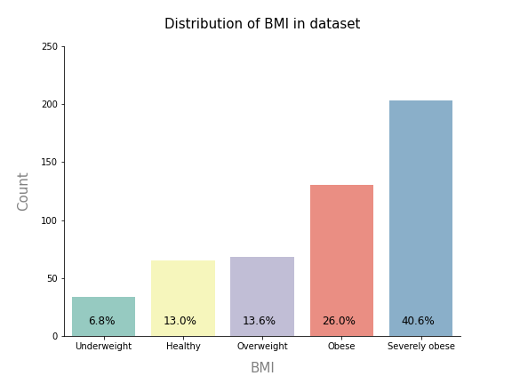
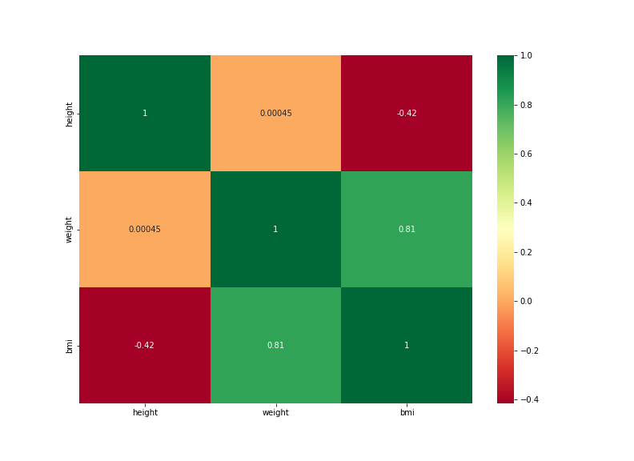

# 🏋 BMI Calculator: Project Overview 
* End to end project researching the effects of BMI and its distribution in gender classes
* Optimised best performing Supervised Learning algorithms using GridsearchCV to obtain optimum performance
* Built a client facing API using flask 
* Built a client facing REST API using flask web framework
* Deployed Model in AWS EC2 Instance  

[View Deployed Model](http://ec2-18-168-206-39.eu-west-2.compute.amazonaws.com:8080/)

## Resources Used
**Python 3.8, SQL Server, Power BI, PowerPoint, WinSCP, PuTTY, Ubuntu, AWS** 

[**Anaconda Packages:**](requirements.txt) **pandas, numpy, pandas_profiling, sklearn, matplotlib, seaborn, sqlalchemy, pyodbc, ipywidgets, kaggle,  pyodbc, XGBOOST, selenium, flask, json, pickle, lxml**   

## [Data Collection](Code/P11_Code.ipynb)
Data loaded through kaggle API
[Data source link](https://www.kaggle.com/yasserh/bmidataset)
[Data](Data/bmi.csv)
*  Rows:500 | Columns: 4
    *   Gender  
    *   Height  
    *   Weight  
    *   Index

## [Data Pre-processing](Code/P11_Code.ipynb)
After I had all the data I needed, I needed to check it was ready for exploration and later modelling. I made the following changes and created the following variables:   
*   General NULL and data validity checks  
*   Added a new column quantifying BMI as the United Kingdom classify it.
*   Dropped old Index column 
*   [NHS Obesity Definition](https://www.nhs.uk/conditions/obesity/#:~:text=18.5%20to%2024.9%20means%20you,means%20you're%20severely%20obese)

## [Data Warehousing](Code/P11_Code.ipynb)
I warehouse all data in a SQL Server instance for later use and reference.

*   ETL in python to SQL Server Database.
*   Formatted column headers to SQL compatibility.  

## [Exploratory data analysis](Code/P11_Code.ipynb) 
I looked at the distributions of the data and the value counts for the various categorical variables. Below are a few highlights from the analysis.
*   I looked at the distribution of BMI by class and gender

*   I looked at the correlation the features have

## [Data Visualisation & Analytics](https://app.powerbi.com/view?r=eyJrIjoiMjJkN2VjOTctODM2ZC00YWY1LThlNTctN2JjYjQxNzk0NTUwIiwidCI6IjYyZWE3MDM0LWI2ZGUtNDllZS1iZTE1LWNhZThlOWFiYzdjNiJ9&pageName=ReportSection)
[View Interactive Dashboard](https://app.powerbi.com/view?r=eyJrIjoiMjJkN2VjOTctODM2ZC00YWY1LThlNTctN2JjYjQxNzk0NTUwIiwidCI6IjYyZWE3MDM0LWI2ZGUtNDllZS1iZTE1LWNhZThlOWFiYzdjNiJ9)
*   I created a correlation matrix to show the relationship between height, weight and BMI
*   I visualised the distribution of bmi class between genders, and found that more men are severly obese than woman generally. 

## [Feature Engineering](Code/P11_Code.ipynb)
I transformed the categorical variable(s) 'gender' into dummy variables. I also split the data into train and tests sets with a test size of 20%.
*   One Hot encoding
*   No scaling, standardisation or normalisation used as the data is well distributed and will not affect the outcome of the model. 

<!-- ## Business Intelligence
AAAAAAAAAAAAAAAAAAAAAAAAA

*   Made a new column for company state 
*   Added a column for if the job was at the company’s headquarters 
*   Transformed founded date into age of company  -->

## ML/DL Model Building 

I tried eight different models and evaluated them using initially using accuracy_score and then MSE/RMSE. I chose MSE and RMSE because it is sensitive to outliers, punishes larger errors and is relatively easy to interpret.   

I tried eight different models:
*   **KN Neighbors Classifier** 
*   **Linear SVC** 
*   **Decision Tree Classifier** 
*   **Random Forest Classifier**
*   **XGB Classifier** 
*   **AdaBoost Classifier**  
*   **Gaussian NB** 
*   **Quadratic Discriminant Analysis** 

## Model performance
The Quadratic Discriminant Analysis model outperformed the other approaches on the test and validation sets. 
*   **Quadratic Discriminant Analysis** : Accuracy = 96% 

## Model Optimisation and Evaluation
In this step, I used GridsearchCV to find the best parameters to optimise the performance of the model.
Using the best parameters, I improved the model accuracy by **1.25%**

*   **Quadratic Discriminant Analysis** : Accuracy = 97.25% | MSE = 0.03 | RMSE = 0.17 (2dp)

## [Deployment](http://ec2-18-168-206-39.eu-west-2.compute.amazonaws.com:8080/)
I built a flask API endpoint that was hosted on a local webserver before AWS EC2 deployment. The API endpoint takes in a request value; height and weight and returns predicted BMI index. I also optimised and formatted the frontend using HTML and CSS. 

## Evaluation 
This project was to show the end-to-end process possible in a data science project. 
*   WWW
    *   The end-to-end process
    *   Deployment and sharing of work 
*   EBI 
    *   Better project management and planning would have made this project faster
    *   Explore GitHub pages deployment through AWS 

## Project Management (Agile | Scrum)
* Resources used
    * Jira
    * Confluence
    * Trello 

## Questions and See more projects    

* #### [See more projects here](https://mattithyahutech.co.uk/)
* #### [Contact me here](mailto:theanalyticsolutions@gmail.com) 

