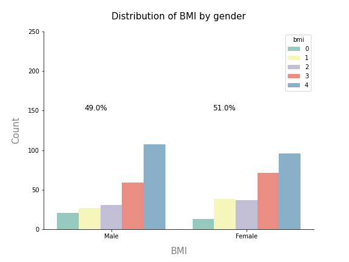
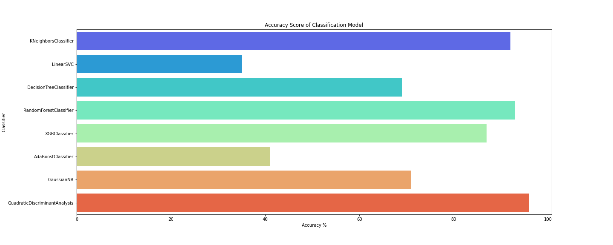

# 🏋 BMI Calculator: Project Overview 
* End to end project researching the effects of BMI and its distribution in gender classes
* Optimised best performing Supervised Learning algorithm using GridsearchCV to obtain optimum performance
* Built a client facing REST API using flask web framework
* Deployed Model in AWS EC2 Instance  

[View Deployed Model](http://ec2-18-168-206-39.eu-west-2.compute.amazonaws.com:8080/)

## Table of Contents 
*   [Resources](#resources)<br>
*   [Data Collection](#DataCollection)<br>
*   [Data Pre-processing](#DataPre-processing)<br>
*   [Data Warehousing](#DataWarehousing)<br>
*   [Exploratory data analysis](#EDA)<br>
*   [Data Visualisation & Analytics](#Dataviz)<br>
*   [Feature Engineering](#FeatEng)<br>
*   [ML/DL Model Building](#ModelBuild)<br>
*   [Model performance](#ModelPerf)<br>
*   [Model Optimisation](#ModelOpt)<br>
*   [Model Evaluation](#ModelEval)<br>
*   [Model Productionising](#ModelProd)<br>
*   [Deployment](#ModelDeploy)<br>
*   [Project Management (Agile/Scrum/Kanban)](#Prjmanage)<br>
*   [Project Evaluation](#PrjEval)<br>
*   [Looking Ahead](#Lookahead)<br>
*   [Questions & Contact me](#Questions)<br>

<a name="resources"></a> 

## Resources Used
**Python 3, SQL Server, Power BI, PowerPoint, WinSCP, PuTTY, Ubuntu, AWS EC2** 

[**Anaconda Packages:**](requirements.txt) **pandas numpy pandas_profiling ipywidgets sklearn matplotlib seaborn sqlalchemy pyodbc kaggle XGBOOST selenium flask json pickle lxml**  
Powershell command for installing anaconda packages used for this project  
```powershell
pip install pandas numpy pandas_profiling ipywidgets sklearn matplotlib seaborn sqlalchemy pyodbc kaggle XGBOOST selenium flask json pickle lxml
```

<a name="DataCollection"></a>

## [Data Collection](Code/P11_Code.ipynb)
Powershell command for data import using kaggle API <br>
```
!kaggle datasets download -d yasserh/bmidataset -p ..\Data --unzip 
```
[Data source link](https://www.kaggle.com/yasserh/bmidataset)
[Data](Data/bmi.csv)
*  Rows: 500 / Columns: 4
    *   Gender  
    *   Height  
    *   Weight  
    *   Index

<a name="DataPre-processing"></a>

## [Data Pre-processing](Code/P11_Code.ipynb)
After I had all the data I needed, I needed to check it was ready for exploration and later modelling. I made the following changes and created the following variables:   
*   General NULL and data validity checks  
*   Added a new column quantifying BMI as the United Kingdom classify it.
*   Dropped old Index column 
*   [NHS Obesity Definition](https://www.nhs.uk/conditions/obesity/#:~:text=18.5%20to%2024.9%20means%20you,means%20you're%20severely%20obese)

```python
# BMI conditions to correct the data index to UK(NHS) classifications
def set_bmi(row):
    if row["newIndex"] < 18.5:
        return 0
    elif row["newIndex"] >= 18.5 and  row["newIndex"] <= 24.999 :
        return 1
    elif row["newIndex"] >= 25 and  row["newIndex"] <= 29.999 :
        return 2
    elif row["newIndex"] >= 30 and  row["newIndex"] <= 39.999 :
        return 3
    else:
        return 4

# Using assign to add new column BMI based on the function conditions
data = data.assign(BMI=data.apply(set_bmi, axis=1))

pd.options.mode.chained_assignment = None  # Supressing SettingWithCopyWarning message

# Creating 'bmiclass' field 
data['bmiclass'] = ''

# Ouputing labelled column based on bmi of individual
data.bmiclass[data['BMI'] == 0] = 'Underweight'
data.bmiclass[data['BMI'] == 1] = 'Normal weight'
data.bmiclass[data['BMI'] == 2] = 'Overweight'
data.bmiclass[data['BMI'] == 3] = 'Obese'
data.bmiclass[data['BMI'] == 4] = 'Severely obese'

# Saving cleaned data as csv for visualisation
data.to_csv('../Data/bmi_clean.csv', index=False)

# Dropping unnecessary columns
data.drop(['Index','newIndex'], axis=1, inplace=True)
```

<a name="DataWarehousing"></a>

## [Data Warehousing](Code/P11_Code.ipynb)
I warehoused this data in a SQL Server instance for later use and reference.

*   ETL in python to SQL Server Database.
*   Formatted column headers to SQL compatibility.  

```python
def ETL_SQLServer(Server,db,tablename):
  """
    :param Server: Destination Server
    :param db: Destination Database name MUST ALREADY EXIST
    :param tablename: Project ID and Dataset name
    """

  # SQL table header format
  tablename = tablename.lower()
  tablename = tablename.replace(' ','_')

  quoted = urllib.parse.quote_plus("DRIVER={SQL Server};SERVER=%s;DATABASE=%s"%(Server,db))
  engine = create_engine('mssql+pyodbc:///?odbc_connect={}'.format(quoted))

  data.to_sql('{tb}'.format(tb=tablename), schema='dbo', con = engine, index=False, if_exists='replace')

  return("ETL successful, {num} rows loaded into table: {tb}.".format(num=len(data.iloc[:,0]), tb=tablename))

# Function to warehouse dataframe
ETL_SQLServer("[SERVER NAME]","Projects","P11 bmi")
```

<a name="EDA"></a>

## [Exploratory data analysis](Code/P11_Code.ipynb) 
I looked at the distributions of the data and the value counts for the various categorical variables. Below are a few highlights from the analysis.
*   I looked at the distribution of BMI by class and . There were no outliers in the data. 




*   The data is generally correlated as expected. 


<a name="Dataviz"></a>

## [Data Visualisation & Analytics](https://app.powerbi.com/view?r=eyJrIjoiMjJkN2VjOTctODM2ZC00YWY1LThlNTctN2JjYjQxNzk0NTUwIiwidCI6IjYyZWE3MDM0LWI2ZGUtNDllZS1iZTE1LWNhZThlOWFiYzdjNiJ9&pageName=ReportSection)
[View Interactive Dashboard](https://app.powerbi.com/view?r=eyJrIjoiMjJkN2VjOTctODM2ZC00YWY1LThlNTctN2JjYjQxNzk0NTUwIiwidCI6IjYyZWE3MDM0LWI2ZGUtNDllZS1iZTE1LWNhZThlOWFiYzdjNiJ9)
*   I created a correlation matrix to show the relationship between height, weight, and BMI
*   I visualised the distribution of bmi class between genders and found that more men are severely obese than woman generally. 

<a name="FeatEng"></a>

## [Feature Engineering](Code/P11_Code.ipynb)
I transformed the categorical variable(s) 'gender' into dummy variables. I also split the data into train and tests sets with a test size of 20%.
*   One Hot encoding
*   No scaling, standardisation or normalisation used as the data is well distributed and will not affect the outcome of the model. 

```python
# One hot encoding for encoding categorical variables
# final_data = pd.get_dummies(data, drop_first=True)

# Gender field is not necessary for this model and reduces the accuracy of the model 
final_data = data.drop(['gender'], axis=1)

# Using train test split to split train and test data 
X_train, X_test, y_train, y_test = train_test_split(X, y, test_size = 0.2, random_state = 23)

# Viewing shape of train / test data
print(X_train.shape)
print(X_test.shape)
```

<!-- ## Business Intelligence
AAAAAAAAAAAAAAAAAAAAAAAAA

*   Made a new column for company state 
*   Added a column for if the job was at the company’s headquarters 
*   Transformed founded date into age of company  -->

<a name="ModelBuild"></a>

## [ML/DL Model Building](Code/P11_Code.ipynb)

I tried eight different models and evaluated them using initially using accuracy_score and then MSE/RMSE. I chose MSE and RMSE because it is sensitive to outliers, punishes larger errors and is relatively easy to interpret.   

I tried eight different models:
*   **KN Neighbors Classifier** 
*   **Linear SVC** 
*   **Decision Tree Classifier** 
*   **Random Forest Classifier**
*   **XGB Classifier** 
*   **AdaBoost Classifier**  
*   **Gaussian NB** 
*   **Quadratic Discriminant Analysis** 

```python
# Preparing algorithms in a list
random_state = 23
classifiers = [
    KNeighborsClassifier(n_neighbors = 5),
    LinearSVC(),
    DecisionTreeClassifier(criterion = 'gini', max_depth = 3),
    RandomForestClassifier(max_features = 'sqrt', n_jobs = 1, verbose = 1),
    XGBClassifier(use_label_encoder=False),
    AdaBoostClassifier(),
    GaussianNB(),
    QuadraticDiscriminantAnalysis()]
```



<a name="ModelPerf"></a>

## [Model performance](Code/P11_Code.ipynb)
The Quadratic Discriminant Analysis model outperformed the other approaches on the test and validation sets. 
*   **Quadratic Discriminant Analysis** : Accuracy = 96% 

<a name="ModelOpt"></a>

## [Model Optimisation](Code/P11_Code.ipynb)
In this step, I used GridsearchCV to find the best parameters to optimise the performance of the model.
Using the best parameters, I improved the model accuracy by **1%**

```python
# Defining parameters for GridSearchCV
params = [{'reg_param': [0.1, 0.2,0.23,0.24,0.25,0.254,0.255,0.256,0.26,0.27,0.28,0.3, 0.4, 0.5,0.6,0.7,0.8,0.9,1.1,1.2]}]

# Initialising algorithm 
qda = QuadraticDiscriminantAnalysis()

# Outputting best param with GridDearch
qda_best = GridSearchCV(qda, params,cv=4)

# Fitting best paramters to X and y
qda_best.fit(X,y)
```

*   **Quadratic Discriminant Analysis** : Accuracy = 97% / MSE = 0.03 / RMSE = 0.17 (2dp)

<a name="ModelEval"></a>

## [Model Evaluation](Code/P11_Code.ipynb)
*   A confusion matrix showing the accuracy score of 97.25% achieved by the model. 


<a name="ModelProd"></a>

## [Model Productionising](app.py)
I built a flask REST API endpoint that was hosted on a local webserver before AWS EC2 deployment. The API endpoint takes in a request value; height and weight and returns predicted BMI index. I also optimised and formatted the frontend using HTML and CSS. 

```python

# Creating flask app / Initiating app
app = Flask(__name__) 

# Load pickle model
model = pickle.load(open("qda_bmi_model.pkl", "rb"))

# Define the home page
# route() decorator to tell Flask what URL should trigger our function.
@app.route("/",methods=['GET'])
def Home():
    return render_template("index.html")

# Predict method
@app.route("/predict",methods=["POST"])
def predict():
    if request.method == 'POST':
        height = int(request.form['height'])
        weight = int(request.form['weight'])

        BMI = round((weight / (height/100)**2),2)
        

        bmi_predict = model.predict([[height,weight]])

        if bmi_predict == 0:
            bmiclass = 'Underweight'
            return render_template("index.html", bmi_text ="BMI = {a}".format(a=BMI),  bmirange_text = "You are in the {c} range.".format(c = bmiclass), index_text = "Index {b}".format(b=bmi_predict))
        elif bmi_predict == 1:
            bmiclass = 'Normal weight'
            return render_template("index.html", bmi_text ="BMI = {a}".format(a=BMI),  bmirange_text = "You are in the {c} range.".format(c = bmiclass), index_text = "Index {b}".format(b=bmi_predict))
        elif bmi_predict == 2:
            bmiclass = 'Overweight'
            return render_template("index.html", bmi_text ="BMI = {a}".format(a=BMI),  bmirange_text = "You are in the {c} range.".format(c = bmiclass), index_text = "Index {b}".format(b=bmi_predict))
        elif bmi_predict == 3:
            bmiclass = 'Obese'
            return render_template("index.html", bmi_text ="BMI = {a}".format(a=BMI),  bmirange_text = "You are in the {c} range.".format(c = bmiclass), index_text = "Index {b}".format(b=bmi_predict))
        elif bmi_predict == 4:
            bmiclass = 'Severly Obese'
            return render_template("index.html", bmi_text ="BMI = {a}".format(a=BMI),  bmirange_text = "You are in the {c} range.".format(c = bmiclass), index_text = "Index {b}".format(b=bmi_predict))
        else:
            return 'UNKNOWN'


if __name__ == "__main__":
    #app.run(debug=True)
    #By enabling debug mode, the server will automatically reload if code changes, and will show an interactive debugger in the browser if an error occurs during a request.
    app.run(host='0.0.0.0', port=8080)
```


<a name="ModelDeploy"></a>

## [Deployment](http://ec2-18-168-206-39.eu-west-2.compute.amazonaws.com:8080/)
An AWS EC2 instance was my choice of cloud platform becasue of its good speed and connectivity. 


<a name="Prjmanage"></a> 

## [Project Management (Agile/Scrum/Kanban)](https://www.atlassian.com/software/jira)
* Resources used
    * Jira
    * Confluence
    * Trello 

<a name="PrjEval"></a> 

## [Project Evaluation](Presentation/P11Presentation.pptx) 
*   WWW
    *   The end-to-end process
    *   Deployment and sharing of work 
*   EBI 
    *   Explore GitHub pages deployment through AWS 
    

<a name="Lookahead"></a> 

## Looking Ahead
*   Using EC2 instances more?? 

<a name="Questions"></a> 

## Questions & Contact me 
For questions, feedback, and contribution requests contact me
* ### [Click here to email me](mailto:contactmattithyahu@gmail.com) 
* ### [See more projects here](https://mattithyahudata.github.io/)
